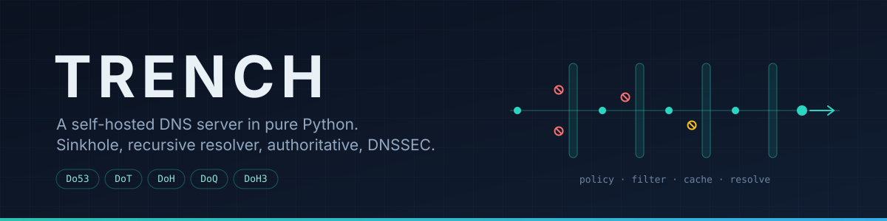
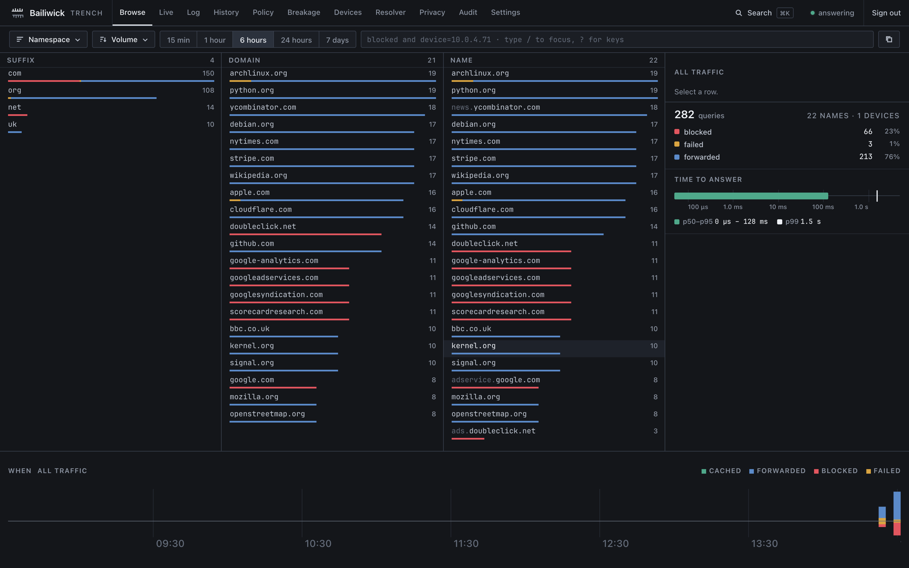
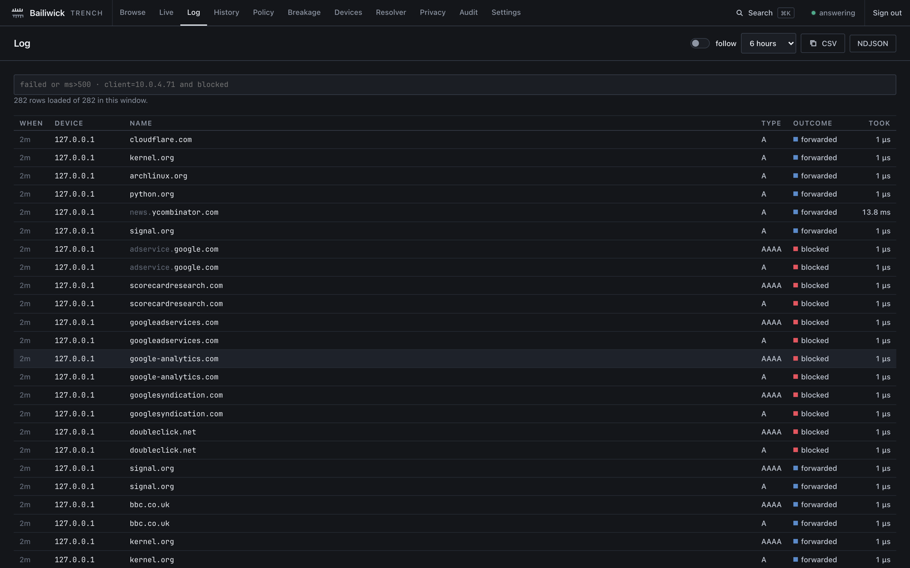
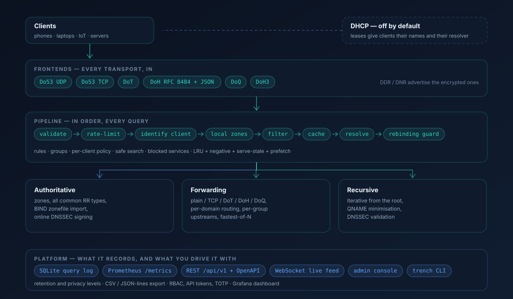

<p align="center">
  
</p>

<p align="center">
  <a href="https://github.com/dev-doshi/trench/actions/workflows/ci.yml"></a>
  <a href="https://github.com/dev-doshi/trench/actions/workflows/docs.yml"></a>
  
  <a href="LICENSE"></a>
</p>

<p align="center">
  <a href="https://dev-doshi.github.io/trench/"><b>Documentation</b></a> ·
  <a href="https://dev-doshi.github.io/trench/installation/">Installation</a> ·
  <a href="https://dev-doshi.github.io/trench/configuration/">Configuration</a> ·
  <a href="https://dev-doshi.github.io/trench/security/">Security</a> ·
  <a href="CHANGELOG.md">Changelog</a>
</p>

---

Trench is the DNS server for a network you run yourself. One asyncio process
answers your devices over every transport they know how to speak, decides what
each of them is allowed to resolve, and either forwards the rest or walks the
delegation chain from the root itself — validating DNSSEC on the way back.

It occupies ground usually split between two programs: a sinkhole in front
(Pi-hole, AdGuard Home) and a resolver behind it (Unbound, BIND). Running both
halves in one process is what makes `trench why <name>` possible — a single
verdict that can name the rule, the list, the client policy, the cache state
and the upstream that produced an answer, because nothing in that chain is
another daemon's business.

It is pure Python — no C extensions, no external resolver — which is a
deliberate trade: easy to read, easy to audit, easy to patch on the box it runs
on, at some cost in raw throughput against a C resolver.

> **Status.** The code is at 2.0.0 and CI is green, but nothing is tagged or
> published yet: install from a checkout or with Compose. When releases start,
> the distribution will be **`trench-dns`** on PyPI (`trench` there belongs to
> an unrelated project) and the image will be `ghcr.io/dev-doshi/trench`.

## Contents

[Quickstart](#quickstart) · [The console](#the-console) · [How a query moves through it](#how-a-query-moves-through-it) · [What it does](#what-it-does) · [Configuration](#configuration) · [CLI](#cli) · [API](#api) · [Development](#development) · [Not implemented](#not-implemented)

## Quickstart

From a checkout — the whole thing runs on unprivileged ports, so nothing on
your machine has to move out of the way:

```bash
git clone https://github.com/dev-doshi/trench && cd trench
pip install -e ".[dev]"
python3 -m trench --dns-port 5354 --upstream 1.1.1.1:53 \
                  --source data/default_blocklist.txt
```

In another terminal:

```bash
dig @127.0.0.1 -p 5354 doubleclick.net    # -> 0.0.0.0   (blocked)
dig @127.0.0.1 -p 5354 example.com        # -> forwarded
open http://127.0.0.1:8089                # the console; the initial admin
                                          # password is printed on first start
```

Without `--source` nothing is blocked — Trench ships no list it did not
compile, and the bundled seed list above is 44 names, enough to prove the path
works. Point `filtering.sources` at a real list (HaGeZi, StevenBlack, OISD) for
coverage.

### With a config file

```bash
cp trench.example.yaml trench.yaml
trenchd --config trench.yaml
```

### Docker

`docker-compose.yml` builds the image from the checkout, so there is nothing
to pull — but it has to run *inside* the checkout, or Compose reports `no
configuration file provided: not found`:

```bash
git clone https://github.com/dev-doshi/trench && cd trench
docker compose up -d
```

It uses host networking and mounts the repository's `trench.yaml`, which binds
DNS on `:53` and the console on `:8089`, both on `0.0.0.0`. DoT (`:853`), DoH
(`:8443`) and DoQ stay disabled until you give it a certificate. Docker Desktop
on macOS and Windows does not hand a container the host's network the way Linux
does, so treat Compose there as a way to build and smoke-test the image rather
than to serve a LAN.

On a Raspberry Pi use `deploy/docker-compose.raspi.yml` instead — it adds the
memory ceiling that keeps a blocklist refresh from being OOM-killed.

### On port 53, for real

Port 53 needs privileges. Install the provided [`trench.service`](trench.service)
— it grants `CAP_NET_BIND_SERVICE` and nothing else, and runs sandboxed — then
set Trench as the DNS server your router hands out over DHCP.

## The console

The console is called **Bailiwick**. It is not a dashboard of totals: it is a
faceted browser over the names your network actually asked for, so you can cut
from a suffix to a domain to a single device without writing a query.

<p align="center">
  
</p>

The query log underneath it is searchable in the same language, follows live,
and exports to CSV or NDJSON:

<p align="center">
  
</p>

## How a query moves through it

<p align="center">
  
</p>

Every query runs the same ordered pipeline, and every stage can be asked what
it decided.

## What it does

<details open>
<summary><b>Transports — every one of them, in both directions</b></summary>

Do53 (UDP and TCP), DoT, DoH (RFC 8484 and the JSON API), DoQ, DoH3. Upstreams
over plain, TCP, DoT, DoH or DoQ, with per-domain routing and parallel,
fastest-of-N or sequential strategies.

**Clients upgrade themselves.** DDR (RFC 9462) answers the `_dns.resolver.arpa`
query Windows 11 and Apple devices already send, and DNR (RFC 9463) puts the
same designation in the DHCP lease — so devices move to DoT/DoH/DoQ without
anyone configuring them. Off until `server.discovery.hostname` names something
clients can authenticate.
</details>

<details>
<summary><b>Filtering — Adblock-DNS syntax, and lists that answer for themselves</b></summary>

`||d^`, `@@`, `$important`, `$badfilter`, `$dnstype`, `$denyallow`,
`$dnsrewrite`, `$ctag`/`$client`; plus regex, hosts, dnsmasq and RPZ formats
(including `rpz-ip`), CNAME-cloaking inspection, and **address lists** — an
answer pointing into a listed network is blocked whatever name it arrived
under.
</details>

<details>
<summary><b>Per-client policy — the network is not one client</b></summary>

Identify by IP, CIDR, MAC or ClientID. Filtering groups with their own lists
and their own upstreams, tags, 89 blocked services on a schedule, forced safe
search, safe browsing, parental controls, and timed pauses — globally or for
one device.
</details>

<details>
<summary><b>Resolution — forward it, or do it yourself</b></summary>

Forwarding with per-domain routing, or full iterative recursion from the root
with QNAME minimisation. DNSSEC validation across RSA, ECDSA P-256/P-384,
Ed25519 and Ed448, with trust anchors read from `root.key` so validation
survives a root roll without a release.
</details>

<details>
<summary><b>Authoritative — your names, signed</b></summary>

Zones with all the common RR types, BIND zonefile import, and online DNSSEC
signing (RRSIG, NSEC, DNSKEY, DS). Zone transfer, NOTIFY and dynamic update,
authenticated with TSIG.
</details>

<details>
<summary><b>Cache — LRU, negative, stale, and warm</b></summary>

LRU with negative caching, serve-stale (RFC 8767), and prefetch, keyed
ECS- and DO-aware.
</details>

<details>
<summary><b>Guards that are unusual to find in a resolver</b></summary>

* **Policy assertions** reject a blocklist refresh that would break a name you
  declared must keep working — before it is applied, not after your video calls
  stop connecting.
* **A silence ledger** names devices still on the network that have stopped
  asking this resolver, which is what an unmanaged device switching to DoH
  looks like from here.
* **A notary** resolves pinned names through every configured upstream and
  reports where they disagree.
* DGA and DNS-tunnelling detection.
</details>

<details>
<summary><b>Platform — what it records and how you drive it</b></summary>

SQLite query log with search, CSV and JSON-lines export, retention and four
privacy levels. REST `/api/v1` with OpenAPI, plus a WebSocket live feed. RBAC,
API tokens, TOTP two-factor, and lockout. Labelled Prometheus `/metrics` with a
latency histogram and a [Grafana dashboard](deploy/grafana-dashboard.json). A
CLI, the console, and config import from Pi-hole and AdGuard Home.
</details>

<details>
<summary><b>Hardening</b></summary>

Rate limiting, DNS-rebinding protection, EDNS padding on encrypted transports,
0x20 encoding, a fuzz-hardened wire parser, and a systemd unit that sandboxes
the process.
</details>

## Configuration

Everything lives in one YAML file; [`trench.example.yaml`](trench.example.yaml)
is the annotated version of it.

| Section | What it holds |
|---|---|
| `server` | enable/port for `do53`, `dot`, `doh`, `doq`, `doh3`; `user`/`group` to shed root; `discovery` (DDR/DNR) |
| `upstream` | `servers`, `strategy`, `mode: forward\|recursive`, `verify`, `dnssec`, `groups`, `trust_anchors` |
| `filtering` | `sources`, `ip_sources`, `allow`/`deny`, `block_mode`, `groups`, `assertions`, `ech`, safe-search/browse/services defaults |
| `clients` | per-client identity and policy overrides, `group`, `upstream_group` |
| `zones` / `local_records` | authoritative zones (`dnssec: true` to sign) and local A/CNAME records |
| `plugins` | `["dns64", {name: block_tld, options: {tlds: [zip, mov]}}]` |
| `security` | `rate_limit`, `rebinding_protection`, `local_suffixes`, `use_0x20`, `silence_ledger`, `notary` |
| `dhcp` | integrated DHCP — **off by default**, and needs `--allow-dhcp` before it will bind |
| `querylog` | `retention_days`, `privacy_level` (0 all … 3 none), `export` |
| `updates` | `mode: off\|notify\|auto`, channel, index, maintenance `window`, `restart` |
| `web` | console host/port, `admin_password`, TLS |

## CLI

```bash
trench query doubleclick.net A                # dig, built in, over @udp/@tcp/@tls/@https/@quic
trench query example.com A @tls --server 9.9.9.9:853
trench why ads.example --client 192.168.1.50 --resolve   # what happened, and why
trench pause 5m --client 192.168.1.50         # let one device through for a while
trench status --token <api-token>             # talk to a running daemon
trench upgrade status                         # what is installed, what is available
trench import pihole /etc/pihole/setupVars.conf
trench profile --dot-host dns.example.com     # an Apple .mobileconfig for encrypted DNS
trench backup / trench restore                # archive or restore the data directory
```

`trench why` is the one to reach for first: it composes every stage that had an
opinion — rules, services, protection, cache, the log, and whether the device
is even still asking this resolver — into a single verdict.

## API

`GET /api/v1/openapi.json` for the spec. Authenticate with the login cookie or
`Authorization: Bearer <token>` (Settings → Access mints tokens).

Key routes: `/stats`, `/querylog`, `/rules`, `/toggle`, `/pause`, `/explain`,
`/history`, `/silence`, `/notary`, `/groups`, `/services`, `/update`,
`/cache/flush`, `/gravity/refresh`, `/clients`, `/system`, `/ws` (live), plus
`/metrics`, `/healthz` and `/readyz`.

## Development

```
trench/
  wire/        DNS message codec (RR zoo, EDNS, fuzz-safe)
  transport/   Do53 / DoT / DoH / DoQ / DoH3 frontends and upstream clients
  engine/      the pipeline (validate→ratelimit→client→zones→filter→cache→resolve→rebinding)
  filter/      adblock parser, compiled index, matcher, RPZ, safe-search, services
  gravity/     blocklist fetch, compile, and scheduling (ETag conditional)
  resolver/    forwarder, recursive (QNAME-min), DNSSEC validation
  cache/       TTL + LRU + negative + serve-stale + prefetch
  clients/     identification and effective policy
  auth_zone/   zones, zonefile parsing, online DNSSEC signing
  store/       SQLite (migrations, query log, retention)
  api/         REST, WebSocket, auth/RBAC, and the console it serves
  web/         the console sources (Vue) and its committed build
  security/    TLS, scrypt hashing, TOTP
  plugins/     plugin API and builtins (dns64, block_tld)
  dhcp/        DHCPv4 (off by default, triple-guarded)
  ops/         Prometheus metrics, Pi-hole/AdGuard import
```

```bash
pytest -q                          # unit, fuzz, cross-transport, DNSSEC sign↔validate
ruff check trench/ tests/ scripts/
python3 scripts/mypy_gate.py       # ratcheted: only new findings fail
```

The suite covers the wire codec (with `hypothesis` fuzzing against a
`dnspython` oracle), the filter matcher truth tables, the cache, every
transport end to end, the recursive algorithm against a mock authority tree,
DNSSEC signing against its own validator, the API and auth, DHCP, plugins and
the hardening layer.

The console is committed as a build artifact, and CI rebuilds it and fails if
the committed `trench/web/dist` does not match the sources — so a console
change means running `npm run build` in `trench/web/frontend` and committing
the result.

## Not implemented

Deliberately out of scope, and said here rather than half-built:

* **dnstap.** The query log streams JSON lines instead. dnstap is Frame Streams
  plus protobuf, and a hand-rolled encoder with no conformance test against a
  real consumer would look present without being it.
* **Automated DNSSEC key rollover.** Signing, NSEC3 and the full chain are
  implemented; rotating keys on a schedule is not.
* **A GeoIP plugin**, and ASN-accurate comparison in the notary — both need a
  data feed this project does not carry, so the notary compares /24 and /48
  networks and says so.
* **DoH over HTTP/2 multiplexing**, DNSCrypt, DHCPv6, clustering, and OIDC
  single sign-on.

## Contributing

[CONTRIBUTING.md](CONTRIBUTING.md) has the short version: the tests and the
lint gates run locally, and a change to behaviour comes with the test that
would have caught it.

Security issues go through the private process in [SECURITY.md](SECURITY.md) —
never a public issue.

## License

[MIT](LICENSE)
